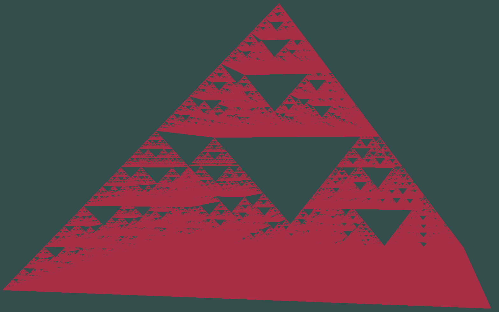

# OpenGL project that generates Siepriński pyramid fractal
- ## Pyramid generates recursively to given depth
- ## Batch rendering used for faster rendering

### Keybinds:
- W,S,A,D,SPACE,C - camera movement
- LSHIFT - faster camera
- SCROLL - camera zoom

### Next step:
- Ray marching
- Quaternion camera

### OpenGL code based on https://learnopengl.com/